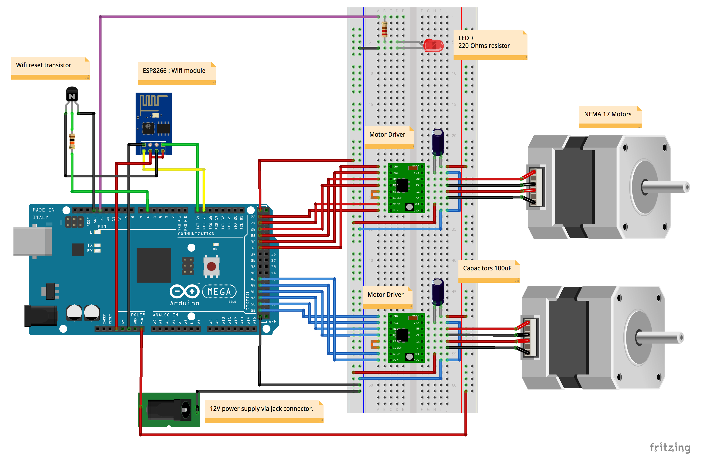
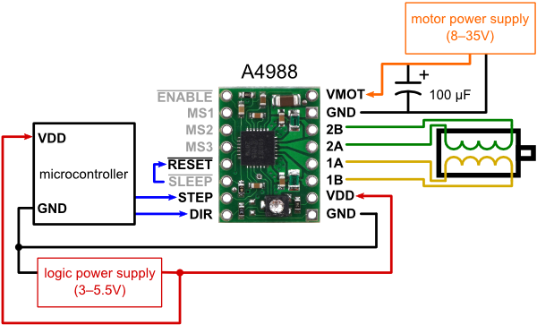
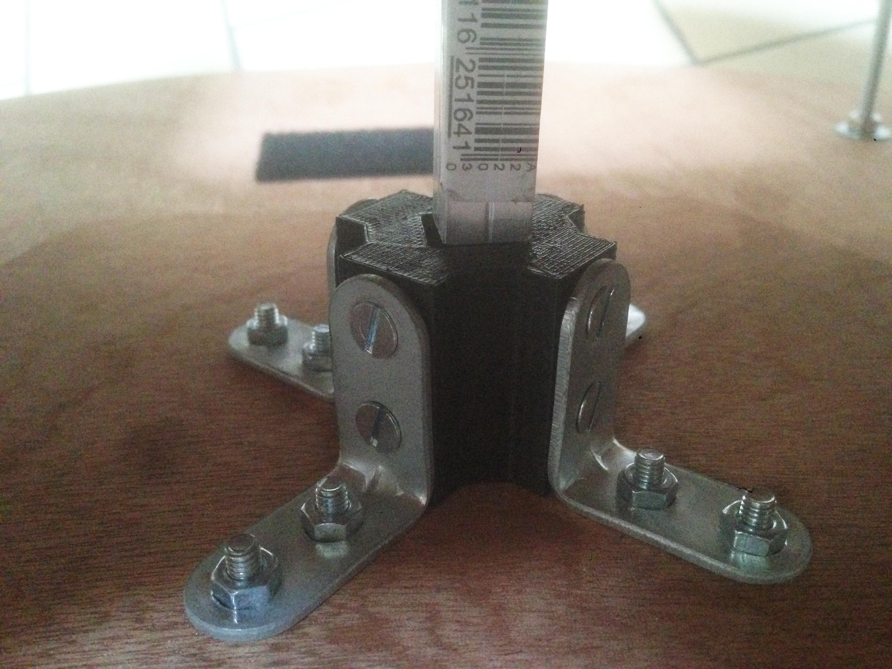

# Documentation Thêta Fantômes

---
## L'installation

### Mise en place

 1. Brancher le routeur wifi.
 2. Attendre que le voyant wifi soit allumé.
 3. Brancher les batteries sur les circuits jaune des plateformes (PAS SUR LA BLEUE, RISQUE DE DESTRUCTION).
 4. La plateforme devrait faire un bruit strident, elle est en marche.
 5. Brancher le module de contrôle des lasers.

### Troubleshooting

*"La plateforme fait un bruit étrange et ne roule pas correctement, voir vibre."*

* La batterie est probablement vide, il faut la recharger ou en utiliser une autre pleine.

*"La plateforme ne roule pas correctement, les moteurs ne forcent pas ou forcent peu lors de la mise sous tension et ne font pas de bruit, voir vibrent."*

* Les drivers n'envoient peut-être pas assez de courant aux moteurs. Il faut donc tourner chaque potentiomètre des drivers avec UN TOURNE VIS CÉRAMIQUE jusqu'à ce qu'ils fassent un bruit et que les moteurs soient bloqués.

*"Un moteur ne fonctionne pas du tout, n'est pas bloqué, et même en tournant le potentiomètre du driver cela n'a aucun effet."*

* Le driver est probablement grillé. Il faut tester avec un nouveau driver.

*"La plateforme est sous tension, fait du bruit mais n'avance pas lorsque l'ordinateur lui envoie une information."*

* Vous avez surement branché les plateformes trop tôt après avoir branché le routeur wifi, attendez que le voyant WIFI de celui-ci s'allume pour débranchez et rebranchez la plateforme.

*"Le module de contrôle des lasers est sous tension mais les lasers ne bougent pas lorsque l'ordinateur lui envoie une information."*

* Vous avez surement branché le module trop tôt après avoir branché le routeur wifi, attendez que le voyant WIFI de celui-ci s'allume pour débrancher et rebrancher le module de contrôle des lasers.

## Technique

À [cette adresse](https///github.com/jottavi/thetafantomes), vous trouverez le dossier contenant :

* le code
* les librairies
* les pièces 3D
* les circuits imprimés
* les drivers

### Wifi

#### Network

Voici les IP et les ports sur lesquels les dispositifs fonctionnent :

<table>
	<thead>
		<tr>
			<th>Dispositifs</th>
			<th>IP</th>
			<th>PORT</th>
			<th>Envoi / Réception</th>
		</tr>
	</thead>
	<tbody>
		<tr>
			<td>Master Machine</td>
			<td>192.168.168.100</td>
			<td>7110</td>
			<td>Envoi &gt; Broadcast</td>
		</tr>
		<tr>
			<td>Laptop Player 1</td>
			<td>192.168.168.101</td>
			<td>7110</td>
			<td>Envoi &gt; Broadcast</td>
		</tr>
		<tr>
			<td>Laptop Player 2</td>
			<td>192.168.168.102</td>
			<td>7110</td>
			<td>Envoi &gt; Broadcast</td>
		</tr>
		<tr>
			<td>Laptop Player 3</td>
			<td>192.168.168.103</td>
			<td>7110</td>
			<td>Envoi &gt; Broadcast</td>
		</tr>
		<tr>
			<td>Laptop Player 4</td>
			<td>192.168.168.104</td>
			<td>7110</td>
			<td>Envoi &gt; Broadcast</td>
		</tr>
		<tr>
			<td>Lasers</td>
			<td>192.168.168.200</td>
			<td>7110</td>
			<td>Réception &gt; 192.168.168.101-102-103-104</td>
		</tr>
		<tr>
			<td>Plateforme Player 1 (Alpha)</td>
			<td>192.168.168.201</td>
			<td>7110</td>
			<td>Réception &gt; 192.168.168.101</td>
		</tr>
		<tr>
			<td>Plateforme Player 2 (Bravo)</td>
			<td>192.168.168.202</td>
			<td>7110</td>
			<td>Réception &gt; 192.168.168.102</td>
		</tr>
		<tr>
			<td>Plateforme Player 3 (Charlie)</td>
			<td>192.168.168.203</td>
			<td>7110</td>
			<td>Réception &gt; 192.168.168.103</td>
		</tr>
		<tr>
			<td>Plateforme Player 4 (Tango)</td>
			<td>192.168.168.204</td>
			<td>7110</td>
			<td>Réception &gt; 192.168.168.104</td>
		</tr>
	</tbody>
</table>

Le module de contrôle des lasers écoute sur toutes les IPs des ordinateurs des joueurs et actionne le laser correspondant au joueur attribué.

Les messages OSC peuvent être envoyés jusqu'à 10 millisecondes sur les lasers, pas moins. Peut-être plus pour les plateformes.

Voici les messages OSC réceptionnés par les dispositifs (plateformes et lasers) :

<table>
	<thead>
		<tr>
			<th colspan="3">Plateformes</th>
		</tr>
		<tr>
			<th>Route</th>
			<th>Valeurs</th>
			<th>Effet</th>
		</tr>
	</thead>
	<tbody>
		<tr>
			<td>/speed</td>
			<td>-10000 => 10000</td>
			<td>Vitesse</td>
		</tr>
		<tr>
			<td>/angle</td>
			<td>-180 => 180</td>
			<td>Rotation</td>
		</tr>
	</tbody>
	</tr>
</table>

<table>
	<thead>
		<tr>
			<th colspan="3">Lasers</th>
		</tr>
		<tr>
			<th>Route</th>
			<th>Valeurs</th>
			<th>Effet</th>
		</tr>
	</thead>
	<tbody>
		<tr>
			<td>/x</td>
			<td>0 => 127</td>
			<td>Position X</td>
		</tr>
		<tr>
			<td>/y</td>
			<td>0 => 127</td>
			<td>Position Y</td>
		</tr>
		<tr>
			<td>/blink</td>
			<td>0 => 171 (0 = OFF / 171 = ON)</td>
			<td>Clignotement</td>
		</tr>
	</tbody>
	</tr>
</table>

#### Programmation

Le module wifi utilisé (ESP8266) contient un petit microcontrôleur programmable et une puce wifi.  
Aussi, pour une meilleur gestion des messages OSC, le module a dû être reprogrammé à partir de l'IDE arduino, en y installant une librairie de gestion du protocole OSC.  
Vous trouverez la documentation de cette librairie à [cet endroit](https///github.com/CNMAT/OSC), et le reste des fonctions se trouvent [ici](http://cnmat.berkeley.edu/library/oscuino/).  
La version utilisée est adaptée pour l'ESP8266, vous la trouverez dans le dossier du projet et à [cette adresse](https///github.com/sandeepmistry/esp8266-OSC).  
Vous pouvez toujours remettre le firmware d'origine, disponible sur le site d'espressif.

Le module MOD-WIFI-ESP8266 de chez Olimex est un mauvais choix de version de module, nécessitant une soudure pour pouvoir le reprogrammer (voir image ci-dessous). En revanche, d'autres modules sont excellents, comme le NodeMcu Lua ESP8266, utilisable plus facilement en standalone, sans arduino, mais sur lequel il est difficile d'ajouter un shield.  

Il est nécessaire d'installer des outils pour pouvoir flasher ces modules avec un nouveau code.

##### Installation des outils de programmation dans l'IDE arduino

Pour commencer à programmer les ESP8266, vous aurez besoin d'installer les librairies relatives à ce module :

* Lancez arduino.
* Aller dans *Arduino > Préférences*.
* Sur cette fenêtre, entrez l'url *http://arduino.esp8266.com/stable/package\_esp8266com\_index.json* dans le champs *"URL de gestionnaire de cartes supplémentaires"* (Image ci-dessous).

* Cliquez sur OK.
* Allez dans *Outils > Type de carte > Gestionnaire de carte*.
* Dans cette fenêtre, recherchez *"esp8266"* et installez la librairie correspondante (voir ci-dessous).

##### Installation du programmeur de l'ESP8266

Pour programmer ce module, nous allons avoir besoin de ce programmeur (voir image), plus simple à utiliser, basé sur la puce CH340.

Les drivers pour cette puce et les instructions d'installation sont présents à [cette page](http://sparks.gogo.co.nz/ch340.html).  
Vous les retrouverez dans le dossier du projet, disponible sur github. Sur linux, il n'est peut-être pas nécessaire de les installer.

##### Uploader un sketch sur l'ESP8266

Une fois ces étapes réalisées, vous devez sélectionner certains paramètres afin de programmer le module.

* Dans Arduino, allez dans *Outils > Type de Carte* et choisissez *"Generic ESP8266 Module"*.

{{:carte-arduino-esp8266.png?direct&300|}}

* Ensuite, lorsque le programmeur est branché, allez dans *Outils > Port* et choisissez *"/dev/cu.wchusbserial410"*.

{{:port-arduino-esp8266.png?direct&300|}}

* Vous pouvez uploader le code.

### Lasers

Le code des lasers est très simple et met en oeuvre une Arduino Uno, un module wifi ESP8266 et un Tinkerkit Dmx Master Shield.  
Comme pour les plateformes, le module wifi relaie l'information osc vers l'arduino uno qui pilote les lasers via le shield DMX.

En revanche, le shield DMX comprend des embases XLR femelles 5 broches non compatibles avec les câbles XLR 3 broches couramment utilisés.  
Voici un schéma de montage pour construire un adaptateur XLR 5 broches vers XLR 3 broches afin de rendre ces câbles compatibles avec le shield.

Le shield est pilotable par la librairie DmxSimple, disponible dans le dossier du projet et utilise la broche digital 3 de l'arduino UNO pour envoyer les commandes DMX.

Ces librairies se trouvent dans le dossier du projet. Vous trouverez la page de DmxSimple à [cette adresse](https///github.com/PaulStoffregen/DmxSimple).  
Pour installer une librairie arduino sur votre IDE, suivez [ce lien](https///www.arduino.cc/en/Guide/Libraries).

### Plateformes

Schéma réalisé avec Fritzing.

#### Moteurs & Drivers

Les branchements du schéma ont été trouvés à [cette adresse](http://wiki.mchobby.be/index.php?title=A4988).

On trouve différents types de circuits compatibles avec les shields des plateformes, triés ci-dessous par efficacité :

 1. [COOLDRV8825](https///www.reprap-france.com/produit/407-pilote-de-moteur-pas-a-pas-cooldrv8825) => Le meilleur, extrêmement puissant
 2. DRV8825
 3. Pololu A4988 Black Edition
 4. Pololu A4988
 5. copies chinoises, à éviter, fonctionnent très mal

__**/!\ ATTENTION, LES DRV8825 SE BRANCHE DANS LE SENS INVERSE DES POLOLU A4988, voir images ci-dessous /!\**__

Une fois la plateforme sous tension, on doit tourner le potentiomètre sur le pololu pour augmenter l'ampérage de sortie et donc la puissance des moteurs. Il faut essayer de bouger la plateforme pour vérifier le niveau d'ampérage utilisé.  
Cette manipulation doit s'effectuer avec un tourne vis en céramique pour ne pas abîmer les drivers (un tourne-vis en métal conduit le courant).

Les moteurs sont contrôlés par les drivers sur 6 ports digitaux :

* ENABLE : Active le pololu et le bloquage du moteur lorsque la broche est en LOW (logique inversée).
* STEP : En passant cette branche sur HIGH puis sur LOW (avec un delai), le moteur fait un pas.
* DIR : Sélectionne le sens de rotation du moteur (ex: LOW -> avance, HIGH -> recule).
* MS1, MS2, MS3 : Définissent la précision du pas (1/4, 1/8, 1/16, voir 1/32 pour les DRV8825).

Nous avons choisi de mettre la précision sur 1/32 de pas (avec un DRV8825) pour que le moteur fasse moins de bruit et que le mouvement soit plus linéaire. Cette précision est modifiable en changeant les signaux entrants sur les ports MS1, MS2 et MS3 des drivers comme ceci (pour un DRV8825) :

 | MS1  | MS2  | MS3  | Resolution du Micro-pas          | 
 | ---  | ---  | ---  | -----------------------          | 
 | LOW  | LOW  | LOW  | Pas de microstepping (full step) | 
 | HIGH | LOW  | LOW  | Demi-pas (half step)             | 
 | LOW  | HIGH | LOW  | 1/4 pas                          | 
 | HIGH | HIGH | LOW  | 1/8 pas                          | 
 | LOW  | LOW  | HIGH | 1/16 pas                         | 
 | HIGH | LOW  | HIGH | 1/32 pas                         | 
 | LOW  | HIGH | HIGH | 1/32 pas                         | 
 | HIGH | HIGH | HIGH | 1/32 pas                         | 

À chaque fois que le signal sur la broche STEP du drivers effectue une période HIGH/LOW, le moteur fait un pas.  
Ainsi, pour contrôler la vitesse des moteur, le code développé utilise une fonction permettant de générer une onde carrée à une fréquence donnée sur une broche de l’arduino, envoyée vers la broche STEP du driver, ce qui fait avancer le moteur plus vite si la fréquence est haute, et plus lentement si la fréquence est basse.

Cette librairie se trouvent dans le dossier du projet. Vous trouverez la page de la librairie à [cette adresse](https///code.google.com/archive/p/rogue-code/wikis/ToneLibraryDocumentation.wiki) et un exemple d’utilisation de cette librairie à [cette page](http://blog.ocad.ca/wordpress/digf6l01-fw201402-01/2014/10/using-arduino-to-play-two-tones-simultaneously/).  
Pour installer une librairie arduino sur votre IDE, suivez [ce lien](https///www.arduino.cc/en/Guide/Libraries).

#### Mécanique & construction

##### Installation de la sculpture sur les plateformes

ATTENTION, lors de l'installation d'une sculpture sur une plateforme, assurez-vous que la tige soit encastrée dans le deuxième socle (le petit sur la plaque de bois inférieure).  
Ne pas hésiter à forcer sur la barre pour la faire glisser dans le socle.

Image du haut : en dehors / image du bas : dedans.

##### Modèles 3D

Si une pièce imprimée en 3D vient à être détruite, vous pouvez toujours en ré-imprimer une à partir des fichiers présents dans le dossier du projet, à l'aide de [ce tutoriel](tuto_imprimante_3d).

##### Améliorations possibles

* __Ventilateur__ : Pour mieux refroidir les drivers de moteur, il peut être bon d'ajouter un petit ventilateur au-dessus de ceux-ci. (Même si les COOLDRV8825 se refroidissent très bien.)
* __Batterie__ : Les changer pour des batteries du style [NiMh 12V environ 4000mAh](http://www.batteryspace.com/airsoftgunbattery12v4200mahnimhbatterypackforairsoftmodguns.aspx). Ce sont des batteries qui ont plus de cycles de recharge, qui sont plus rapides à charger, et (beaucoup) moins lourdes que les batteries au plomb.
* __Roues/stabilisateurs__ : Utiliser des [stabilisateurs (ball caster) avec des billes en nylons](https///www.pololu.com/product/2692), un matériau très silencieux lors de frictions avec une autre surface. En revanche, attention à la hauteur de ces stabilisateurs, peut-être trop hauts pour être fixés sur les plateformes.
* __Protection du bois__ : L'humidité et la lumière peuvent faire gondoler le bois. Un saturateur pour bois peut être appliqué sur celui-ci ou bien des plaques peuvent être redécoupées dans du contre-plaqué marin, très résistant à l'eau.

